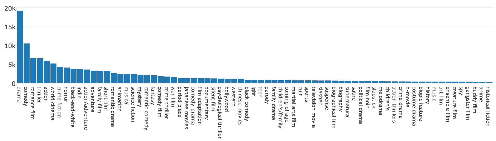

# In a World...

... where we can automatically produce genres from movie summaries.

To get some experience with NLP and text classification, subjects on which I've had minimal exposure, I decided to take a crack at predicting genre tags from a text summary of a film.  The focus here is on creating a working end-to-end system, not a highly polished API or a finely-tuned classifier.  That being said, the API is relatively easy to use and the default classifier performs fairly well.

It so happens that I came across a data set--scraped from Wikipedia--that lists metadata for roughly 42000 movies, including genres and summaries.  This data, included in the repo, is the default choice for classifier training and validation.  This repo has an accompanying Jupyter notebook that shows the structure of that data, explores genre tag statistics, and demonstrates the usage of this package.

## Dependencies and Installation

`Inaworld` was built and tested using the following environment and packages
* Anaconda Python distribution (Python 3.6)
* scikit-learn 0.18.1
* numpy 1.11.3
* scipy 0.18.1
* pandas 0.19.2

To install `inaworld`, you can either clone the repo,
```
git clone https://github.com/epfahl/inaworld
```
and use from within the cloned directory, or pip install directly from github,
```
pip install git+https://github.com/epfahl/inaworld
```
The latter should handle the dependencies via `setup.py`, but be aware that I have not yet tested this in a virtualenv.

## Basic Usage

`Inaworld` has both functional and OO APIs.  It's easiest to get started with the OO API.  The followings lines, executed in a shell or Jupyter notebook, will load the canned movie data and train a classifier:

```python
>>> from inaworld import MoviesGenres
>>> mg = MovieGenres().load().train()
```

Loading and training should take a minute or less, depending your computer's horsepower.  The object `mg` gives access to various model parameters, as well as the input data, the specific training and test data used for classifier training and validation, and a `predict` method that consumes a single movie summary and returns a list of genres.

Let's pick a summary at random from the data set, predict the genres, and compare the results to the actual recorded genres:

```python
>>> idx = 12345   # there are over 40000 movies in the default data set
>>> summary = mg.data['summaries'][idx]
>>> summary
'Sam is a self-destructive, vaguely artistic New York bohemian who has recently lost his father and his long-time girlfriend. At a Halloween party he meets a mysterious, beautiful, androgynous woman named Anna. He embarks on a kinky, sex-charged relationship with her; but soon he suffers the symptoms of blood loss, and eventually he realizes that Anna is a vampire.'
>>> mg.predict(summary)
['drama', 'horror', 'psychological thriller', 'romance film']
>>>mg.data['genres'][idx]
'["Romance Film", "Drama", "Horror", "Psychological thriller"]'
```

Cool.  (Yeah, this perfect match is suspicious, but I promise I didn't cherry pick!)

## Problem Statement and Approach

The prediction of multiple genre tags (or labels) from a document is a well-trodden problem, and is an example of *multi-label* classification.  Depending on assumptions and desired sophistication, this classification problem can be attacked with a wide range of techniques.  But before addressing the classification methodology, we should say a few words about how the data is prepared.

### Vectorization

A classifier that works with text doesn't actually work with text.  Machine learning algorithms operate on numerical representations of data.  A document or a list of tags is converted to an array of numbers--a transformation known as *vectorization*.  This conversion can be accomplished in a variety of ways.  `Inaworld` vectorizes movie summaries by replacing each valid word, or *token*, with its [TF-IDF](http://docs.python-cerberus.org/)  (term frequency-inverse document frequency) statistic.  In essence, TF-IDF records how often a word occurs in a document, inversely weighted by the log of the fraction of documents that contain the word.  TF-IDF gives less weight to words that are very common across the corpus.  `Inaworld` vectorizes movie summaries with the scikit-learn class `TfidfVectorizer`.

Genre tag vectorization is straightforward.  List all the unique tags in the movies data set in alphabetical order.  When a genre is present for a given movie, put a 1 at the position of the corresponding tag; otherwise, put a 0.  For each movie, there is a corresponding binary vector that represents the associated list of tags.  Scikit-learn does the heavy lifting of genre vectorization with the class `CountVectorizer`.  

Genres are comma-separated words or phrases.  There is no ambiguity in parsing and listing the individual genre tags.  But the situation isn't so simple for the movie summaries.  Should we split a summary into individual words?  Pairs or triplets of words?  Should individual words be reduced to some root grammatical form (known as *stemming*)?  What about super common, uninformative words like 'the' or 'you' (so-called *stop words*)?  The answers to these questions depend on a number of factors, and different choices should be evaluated when designing a high-performance classifier.  `Inaworld` applies the following specific constraints on summary tokenization:
* Only unigrams (single words) are considered.
* Words with punctuation or numbers are excluded.
* Stop words are excluded.
* By default, words that appear in more than 25% of the documents are excluded, but this parameter can be changed.

### Data Preparation

In what machine learning problem do we not spend 80% of our time on preparing the data so that it can be consumed by transformation and classification algorithms?  The movie data set used here (`movie_data.csv` in the repo) is actually in a pretty decent state, especially if we're interested only in genres and summaries.  Each row of the table has movie, title, release date, revenue, run time, a list of genres, and a summary.  

Movie genres are listed as single strings, like
```
'["Romance Film", "Drama", "Horror", "Psychological thriller"]'
```
Parsing this as a list of genres isn't a problem.  A regex substitution and comma split does the job nicely.  However, there are rows with emtpy genre lists (411 rows, to be exact), recorded as `[]`.  These rows should be excised from the data set before further processing, since they offer no value for the task at hand.

Summaries are provided as simple string, like
```
'The film portrays an aggressive and belligerent police officer named Nariman who investigates a murder case for which an innocent man is falsely accused.'
```
Once the summary token regex pattern is specified, along with a couple of other parameters, `TfidfVectorizer` handles the tokenization and vectorization of the summaries; no additional pre-processing is necessary.  Fortunately, there are no empty summary strings in the data set, but `inaworld` has code to remove rows with zero-length summaries, just in case.

In addition to removing rows with no genres, we might also want to remove rows where the only genres present are relatively rare.  Rare genres are unlikely to be returned in the classification, and training may be a challenge, since the training set may have genres not present in the validation set, or vice versa.  To perform this filtering, we need to count the number of times each genre appears across the corpus.  Genre counting is easiest with the vectorized form of the genre data--a matrix where each row is a binary indicator vector.  The filtering process is as follows

1. Sum along each column of the matrix to obtain the count per genre.
2. Find the matrix columns for which the count is larger than a given threshold.
3. Create a new matrix where only the above columns are retained.
4. Find the rows in the new matrix for which there is at least one genre.

The final filter is just what we're after, and it is applied to the vectorized genres and the array of summaries.      

### Classification

* one-vs-rest plus binary classifier
* neglects conditional dependence of genres

### Training

* genre class imbalance (figure)
* stratified split



## Performance

While the initial goal of `inaworld` was just to get something to work that didn't look too stupid, it turns out that the performance of the classifier isn't terrible.  The approximate weighted average precision, recall, and F1 score, across all genres, are, respectively, 0.89, 0.64, and 0.73.       


* perhaps longer summaries are more accurately classified
* didn't tune hyperparameters, including the binary classifier, and various tokenization and vectorization assumptions


## Final Thoughts

* tokenization (stemming, remove proper nouns, remove non-words [e.g., 'aaaah'])
* different binary classifiers (kernel SVM, naive bayes, logistic regression)
* entirely different approach (kNN variant to account for tag correlations)
* Not only do genres tend to show correlations, but there may also be hidden
semantic relationships.  For instance, if 'drama' is a returned tag, but the
actual tag is 'melodrama,' does that count as a miss?
* cache the trained classifier for production performance (e.g., real-time tagging).
